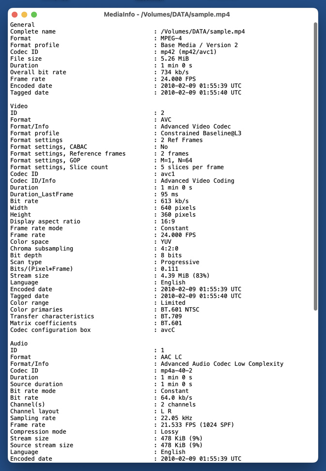
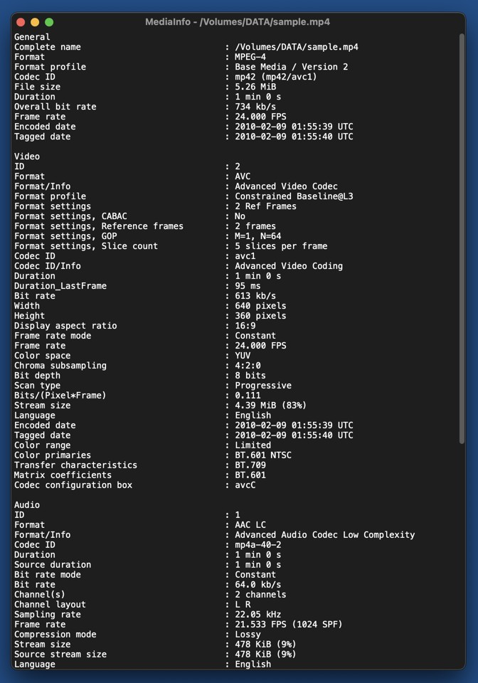

# Minimal MediaInfo GUI for macOS

A minimal but free GUI for [MediaInfo](https://mediaarea.net/de/MediaInfo) in macOS.   
It displays all infos for some media file as plain text, and that's it.   
Media files can either be dropped into the application's window or on the application's Finder/Dock icon.  
Implemented in 80 lines of Python code.

## Screenshots

*MediaInfo GUI in macOS 13 (light)*  

*MediaInfo GUI in macOS 13 (dark)*  

